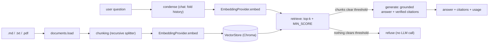

# RAG Demo

A small, production-shaped **Retrieval-Augmented Generation** service. You
ingest documents (`.md`, `.txt`, `.pdf`), ask natural-language questions, and get
answers that are **grounded in your documents and cite their sources** with a
**verifiable quote**. When the documents don't contain the answer, the system
**refuses to answer** rather than guessing.

It is deliberately built to *look and behave like it could go to production*
(clean interfaces, dependency injection, typed errors, per-request correlation
ids, async end-to-end, multi-tenancy, multi-turn chat) while shipping
**lightweight, embedded implementations** you can clone and run locally with no
infrastructure. Every seam is an interface with a documented production swap —
see [Scaling path](#scaling-path).

The entire test suite runs **offline with no API key**.

---

## What it does

- **Ingest** documents by uploading them over HTTP; they are loaded, chunked,
  embedded, and stored per user.
- **Ask** a one-shot question (`/ask`) and receive an answer plus citations back
  to the exact source chunks (`source#chunk_index`), each with a verbatim quote.
- **Chat** multi-turn (`/chat`): prior turns are condensed into a standalone
  query before retrieval, so a bare follow-up ("tell me more about it") still
  retrieves the right context.
- **Refuse** to answer when nothing relevant is retrieved, or when the model's
  citations can't be verified against the retrieved text (guardrail against
  hallucination).
- **Isolate tenants**: every request carries a `user_id`; a user only ever
  retrieves their own uploads, and can delete all their data.
- **Observe**: one structured JSON log line per request with a correlation id,
  retrieved chunk ids and scores, sub-timings, and token usage.

---

## Architecture



Each module depends only on interfaces, so providers and stores are swappable:

| Module | Responsibility |
| --- | --- |
| `config.py` | Typed, validated, env-driven settings (`RAG_*` prefix). |
| `logging_utils.py` | Stdlib JSON logging: ISO timestamp, per-request correlation id, dedicated `rag` logger, stdout/stderr split. |
| `errors.py` | Unified typed-error taxonomy (`DocumentError` / `ProviderError` / `StoreError`) → structured API envelopes. |
| `documents.py` | Load `.md` / `.txt` / `.pdf` into normalized `Document`s from a path or in-memory bytes; per-file typed failures. |
| `chunking.py` | Dependency-free recursive splitter (paragraph → sentence → word → hard split) with a hard size cap and whole-unit overlap. |
| `providers/` | `EmbeddingProvider` / `LLMProvider` protocols; OpenAI implementation; `build_providers()` factory. |
| `vectorstore/` | `VectorStore` protocol (typed `ChunkRecord`, upsert/delete/`where` filter); Chroma backend; `build_store()` factory. |
| `conversation/` | `ConversationStore` protocol; two-tier `RedisConversationStore` (Redis hot + SQLite durable); `build_conversation_store()` factory. |
| `ingest.py` | Orchestrates load → chunk → embed → store; per-file partial success; delete-before-readd. |
| `retrieve.py` | Condense (multi-turn) → embed query → top-k → `MIN_SCORE` threshold; per-user `where` filter. |
| `generate.py` | Injection-aware prompt, structured-JSON output, extractive citation verification, refusal guardrail. |
| `pipeline.py` | Ties retrieve + generate together; `ask` / `chat`; structured observability. |
| `api.py` | FastAPI: `/health`, `/ingest` (uploads processed in memory, never written to disk), `/ask`, `/chat`, `/conversations`, `DELETE /documents`; CORS; correlation-id middleware. |

### Project layout

```
RAG_Demo/
├── corpus/                     # sample, self-written documents
├── src/rag/
│   ├── config.py  logging_utils.py  errors.py
│   ├── documents.py  chunking.py
│   ├── ingest.py  retrieve.py  generate.py  pipeline.py
│   ├── api.py
│   ├── providers/    {base, openai_provider}.py
│   ├── vectorstore/  {base, chroma_store}.py
│   └── conversation/ {base, redis_store, sqlite_durable}.py
├── tests/
│   ├── doubles/                # test-only: fake provider + in-memory stores
│   └── ...                     # unit + integration tests, fixtures/
├── requirements.txt  requirements-dev.txt  pyproject.toml
└── .env.example
```

The **fake provider** and **in-memory stores** are test aids, not shipped code:
they live under `tests/doubles/` and are injected directly into the pipeline by
the test suite. The production factories only ever build the real backends
(OpenAI + Chroma + Redis).

---

## Quickstart

Requires Python 3.11+.

```bash
# 1. Create and activate a virtual environment
python -m venv .venv
# Windows (PowerShell):
.\.venv\Scripts\Activate.ps1
# macOS/Linux:
# source .venv/bin/activate

# 2. Install (editable install exposes the `rag.api` ASGI app)
pip install -e ".[dev]"

# 3. Configure
copy .env.example .env      # Windows;  use `cp` on macOS/Linux
# then set OPENAI_API_KEY in .env  (not needed just to run the tests)
```

> **Running locally?** The real service calls OpenAI, so set `OPENAI_API_KEY`
> in your `.env` before starting the server. It is only unnecessary for the test
> suite, which runs fully offline against the fake provider.

### HTTP API

```bash
uvicorn rag.api:app --reload
```

The HTTP API is the product surface (a React UI is the intended client). There
is no CLI.

- `GET /health` → `{ "status": "ok" }` (a bare liveness signal; it does not
  disclose the provider or internal config).
- `POST /ingest` (multipart file upload) → counts of documents/chunks plus a
  per-file `failures` array. Oversized/unsupported files are reported per file
  instead of failing the whole batch.
- `POST /ask` `{ "query": "..." }` → answer, verified citations, retrieved
  chunks, usage, latency (stateless, one-shot).
- `POST /chat` `{ "query": "..." }` → same shape plus a `conversation_id`, but
  multi-turn: send an `X-Conversation-Id` header to continue a thread.
- `GET /documents` → list the caller's ingested sources with per-source chunk
  counts (drives the manage-files UI).
- `DELETE /documents/{source}` → delete a single ingested source (idempotent).
- `DELETE /documents` → "delete all my data" for the caller's uploaded corpus.
- `GET /conversations`, `GET /conversations/{id}`, `DELETE /conversations` →
  list / read / purge the caller's conversation history.

**Identity / tenancy.** Every request carries a `user_id` supplied via the
`X-User-Id` header; if absent, the server mints one and echoes it back (in the
body and the `X-User-Id` header). It is a tenant/correlation key, **not
authentication** — real auth is a documented future step. A user only ever
retrieves their own uploads.

```bash
# The server mints and echoes an X-User-Id; reuse it to keep your corpus.
curl -i -F "files=@corpus/rag_overview.md" http://127.0.0.1:8000/ingest

curl -H "Content-Type: application/json" -H "X-User-Id: <your-id>" \
     -d '{"query":"What are the stages of a RAG pipeline?"}' \
     http://127.0.0.1:8000/ask
```

Interactive docs are available at `http://127.0.0.1:8000/docs`.

### Web UI

A React (Vite + TypeScript + MUI) front end lives in [`frontend/`](frontend/):
drag-and-drop upload, per-file management (list / delete / replace via
`GET /documents` and `DELETE /documents/{source}`), and a grounded, cited chat
over your documents (`/chat`). With the API running:

```bash
cd frontend
npm install
npm run dev
```

The dev server proxies API calls to `http://127.0.0.1:8000`, so there are no
local CORS issues. See [`frontend/README.md`](frontend/README.md) for details.

---

## Configuration

All settings are environment variables (prefix `RAG_`, except the standard
`OPENAI_API_KEY`), validated at load time. See `.env.example`.

| Variable | Default | Purpose |
| --- | --- | --- |
| `OPENAI_API_KEY` | – | OpenAI key (required to run the real service). |
| `RAG_CHAT_MODEL` | `gpt-5.4-mini` | Chat model. |
| `RAG_EMBEDDING_MODEL` | `text-embedding-3-small` | Embedding model. |
| `RAG_CHAT_TEMPERATURE` | `0.0` | Sampling temperature (0 = deterministic, the right default for grounded RAG). |
| `RAG_REQUEST_TIMEOUT_SECONDS` | `30.0` | Per-request timeout for provider calls. |
| `RAG_MAX_RETRIES` | `2` | Retries on transient 429/5xx (SDK native backoff). |
| `RAG_EMBEDDING_BATCH_SIZE` | `100` | Texts per embeddings call (batches large ingests). |
| `RAG_PERSIST_DIR` | `.chroma` | Chroma persistence directory. |
| `RAG_COLLECTION` | `rag_demo` | Chroma collection name. |
| `RAG_MAX_UPLOAD_BYTES` | `10485760` | Largest single upload accepted (10 MiB). |
| `RAG_CORS_ALLOW_ORIGINS` | `*` | Comma-separated browser origins allowed to call the API. |
| `RAG_TOP_K` | `4` | Chunks retrieved per query. |
| `RAG_MIN_SCORE` | `0.2` | Cosine-similarity threshold for the guardrail. |
| `RAG_CHUNK_SIZE` | `800` | Hard cap on chunk size (characters). |
| `RAG_CHUNK_OVERLAP` | `150` | Overlap between chunks (characters). |
| `RAG_SESSION_TTL_SECONDS` | `86400` | TTL for per-user data + conversation keys. |
| `RAG_REDIS_URL` | – | Redis hot layer; unset → in-process `fakeredis`. |
| `RAG_CONVERSATION_DURABLE_PATH` | `conversations.sqlite3` | SQLite durable tier for chat state. |
| `RAG_CONVERSATION_HISTORY_LIMIT` | `10` | Recent messages fed back per chat turn. |
| `RAG_LOG_LEVEL` | `INFO` | Log level. |

There is no `fake` provider option: the offline fake is a test double, injected
directly by the suite rather than selected via config.

---

## Design decisions and tradeoffs

**Provider-agnostic interfaces.** Embeddings and chat sit behind
`EmbeddingProvider` / `LLMProvider` protocols; OpenAI is the shipped
implementation (one SDK for both, imported lazily so the package imports without
`openai` or a key). A deterministic **fake provider** implements the same
protocols so the whole suite runs offline — but it is a *test aid* under
`tests/doubles/`, injected directly, never a shippable "offline mode".

**Async end-to-end.** Providers, the vector store, retrieval, generation,
ingestion, and every request handler are `async`. This costs nothing locally and
is exactly the production shape; the OpenAI adapter uses `AsyncOpenAI` and the
blocking Chroma / disk / document-load calls are offloaded to a threadpool so the
event loop never stalls.

**Recursive, dependency-free chunking.** `chunk_text` splits largest→smallest
(paragraph → sentence → word → hard character split), packs whole units up to a
**hard** character cap, and carries overlap as whole units. Characters (not
tokens) keep it tokenizer-free; the limitations of the regex sentence heuristic
are documented in the module.

**Grounding is verified, not trusted.** The model must return structured JSON
(`refused`, `answer`, `citations:[{marker, quote}]`). The code checks each
`quote` is a verbatim (whitespace-normalized) substring of the cited chunk and
drops any it can't verify; an answer is `grounded` only if ≥1 citation survives,
otherwise it refuses. Markers come from the structured field (not a regex over
the prose), so text smuggled into a document can't manufacture a citation. A
`finish_reason` of `length` (truncation) is treated as unreliable → refuse.

**`TOP_K` and `MIN_SCORE`.** Retrieval returns the `top_k` nearest chunks, then
drops any below `min_score` (cosine similarity). The threshold is the first line
of the anti-hallucination guardrail: if everything is filtered out, `generate`
refuses **without calling the LLM**. `MIN_SCORE` is the main knob to tune per
corpus.

**Typed errors, structured envelopes.** Domain failures are `RagError`
subclasses carrying a machine-readable `code` + `context` (no user-facing prose —
the UI owns wording). The API translates any `RagError` into
`{"error": {domain, code, context}}` with the code's status, and a catch-all
turns any unforeseen exception into a generic `INTERNAL` 500 with no leaked
traceback.

**Multi-tenancy.** A `user_id` is stamped on every chunk's metadata; retrieval
filters `where={"user_id": ...}` so tenants are isolated and chunk ids are
namespaced per user. Data is ephemeral: `created_at` + an on-demand
`cleanup_expired` and a `DELETE /documents` purge implement the "delete my data"
story without a scheduler.

**No-persistence ingestion.** Uploaded files are chunked and embedded entirely
in memory and are **never written to disk** — only the derived vectors (Chroma)
are durable. This keeps app servers stateless and closes two gaps a disk staging
area would open: orphaned staged files, and raw copies surviving
`DELETE /documents` / TTL cleanup. Retaining originals is a documented swap (see
[Scaling path](#scaling-path)).

**Conversation state = KV/session (Redis hot + durable).** Multi-turn history is
an append / read-last-N / expire-on-TTL access pattern — a key-value/session
shape, not relational or document. It ships as a two-tier
`RedisConversationStore`: a Redis hot layer (native per-key `EXPIRE`) with
write-through to an embedded **SQLite** durable tier, and rehydrate-from-durable
on a hot-layer miss. Local runs use a real Redis if `RAG_REDIS_URL` is set, else
an in-process `fakeredis` (same `redis-py` API) so clone-and-run needs no server.

**Observability.** A pure-ASGI middleware binds a per-request **correlation id**
(read from `X-Correlation-Id` or minted, echoed back) into every log record via
a contextvar. Each `ask`/`chat` emits one structured JSON line with the id,
retrieved chunk ids/scores, retrieval/generation sub-timings, `grounded`, and
token usage; failures are logged with a stack and re-raised so the API envelope
still forms.

**Prompt-injection basics.** The system prompt instructs the model to treat
context as **untrusted data, not instructions**, and the rules live in the
system role (which uploaded documents can't edit). This doesn't defeat every
attack but covers the common "ignore your instructions" smuggled into a document.

### Scaling path

The demo ships lightweight embedded backends; each sits behind an interface with
a documented production swap — no changes to ingestion, retrieval, or generation:

| Concern | Demo (shipped) | Production swap (same interface) |
| --- | --- | --- |
| Uploaded originals | Processed in memory, never persisted | If retention is ever required, stream to object storage (S3 / Azure Blob / GCS) — never local disk or a relational DB. |
| Vector store | Embedded Chroma (`PersistentClient`, local disk) | Chroma client/server, or managed pgvector / Azure AI Search / Cosmos vector. App servers become stateless; data tier scales independently. |
| Conversation hot layer | Redis (or in-proc `fakeredis`) | Managed Redis / ElastiCache. |
| Conversation durable tier | Embedded SQLite | Postgres or Cosmos behind `DurableConversationBackend`. |
| Providers | OpenAI adapter | Any vendor implementing the provider protocols (+ typed `ProviderError` mapping). |
| Identity | `X-User-Id` tenant key (not auth) | Real auth (JWT/OIDC) resolving to the same `user_id`; rate limiting. |

---

## Testing

The suite is fully offline and needs no API key or network. It injects the test
doubles under `tests/doubles/` (fake provider + in-memory vector/conversation
stores) directly — nothing is selected through the production factories:

```bash
pytest
```

Coverage of the core logic:

- **Chunking** (`test_chunking.py`) — recursive boundaries, hard size cap,
  whole-unit overlap, oversized-token hard split, parameter validation.
- **Retrieval** (`test_retrieval.py`) — ranking order, threshold include/exclude,
  `k` limiting, per-user isolation, re-ingest of a shrunk file.
- **Vector store contract** (`test_vectorstore.py`) — upsert-by-id, delete /
  delete-by-source, dimension validation, `where` filtering, typed metadata.
- **Citations / generation** (`test_citations.py`) — structured-JSON grounding,
  quote verification, grounded-requires-verified-citation, structured refusal,
  truncation handling.
- **Errors** (`test_errors.py`, `test_documents.py`, `test_api_errors.py`) —
  envelope shape + status map, typed document loader, generic INTERNAL 500.
- **Tenancy** (`test_tenancy.py`) — minted-id echo, end-to-end isolation, purge,
  on-demand TTL cleanup.
- **Conversation** (`test_conversation.py`) — in-memory double, two-tier Redis
  (fakeredis) + SQLite (append / last-N / native TTL / rehydrate-on-miss),
  end-to-end multi-turn `/chat`.
- **Observability** (`test_observability.py`) — JSON timestamp, correlation-id
  filter + HTTP propagation, stdout/stderr split, failure logging.
- **API hardening** (`test_api_hardening.py`) — `/health` non-disclosure, upload
  size limit, CORS headers.
- **Integration** (`test_pipeline_integration.py`) — full ingest → ask over a
  fixture corpus, at both the pipeline and HTTP layers.

---

